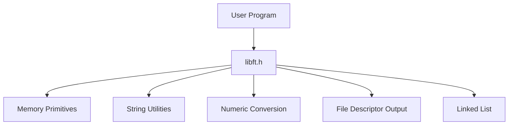

# libft

> A small systems programming utility library implemented in C, providing foundational memory, string, and container primitives.


---

# Table of Contents

* [Overview](#overview)
* [Design Goals](#design-goals)
* [Example](#example)
* [Architecture](#architecture)
* [Modules](#modules)
* [Build](#build)
* [Project Structure](#project-structure)
* [Implementation Notes](#implementation-notes)
* [Engineering Notes](#engineering-notes)
* [License](#license)

---


# Overview

`libft` is a lightweight C utility library that reimplements a curated subset of standard C and POSIX functionality.

The library is compiled into a **static archive (`libft.a`)** and intended to be linked into other C programs that require low-level primitives for memory manipulation, string processing, numeric conversion, and simple container structures.

Rather than wrapping existing libc implementations, each function is implemented from first principles. This makes the behavior of memory operations, pointer arithmetic, and allocation semantics fully explicit.

The result is a reusable low-level foundation for systems-oriented C programs.

---

# Design Goals

The library prioritizes a few core principles:

**- Correctness:** Functions aim to replicate the behavior of their standard C counterparts where applicable, including edge cases and boundary conditions.

**- Explicit memory ownership:** Functions that allocate memory clearly transfer ownership to the caller.

**- Low-level transparency:** Operations are implemented directly on raw byte buffers and pointers.

**- Minimal coupling:** Modules are independent and avoid cyclic dependencies.

**- Reusability:** The static archive can be linked into any C program without additional runtime dependencies.

---

# Example

```c
#include "libft.h"

int main(void)
{
    char **tokens = ft_split("one:two:three", ':');

    for (int i = 0; tokens[i]; i++)
    {
        ft_putendl_fd(tokens[i], 1);
        free(tokens[i]);
    }

    free(tokens);
}
```

Output

```
one
two
three
```

---

# Architecture

The library is structured as a **flat modular static library** exposed through a single public header.



Lower-level primitives form the base of the library.

Memory operations are used by higher-level modules such as string utilities, but the reverse dependency never occurs. This keeps the dependency graph simple and avoids circular coupling.

---

# Modules

The library contains five functional groups.

**- Character classification:** Utilities for checking character classes such as alphabetic, numeric, ASCII, or printable characters.

**- Memory primitives:** Low-level byte manipulation utilities including memory copying, comparison, searching, and allocation helpers.

**- String utilities:** Functions for measuring, copying, concatenating, splitting, and transforming NUL-terminated strings.

**- Numeric conversion:** Conversion between textual and integer representations.

**- Linked list container:** A small singly linked list abstraction implemented using `void *` content pointers and caller-provided function callbacks.

---

# Build

Requirements:

* GCC or Clang
* GNU Make
* POSIX system (Linux or macOS)

Build the library:

```bash
git clone https://github.com/artclave/libft-42.git
cd libft-42
make
```

This produces the static archive:

```
libft.a
```

Example linking:

```bash
gcc -I includes main.c libft.a -o program
```

---

# Project Structure

```
libft/
├── includes/
│   └── libft.h
│
├── srcs/
│   ├── memory/
│   ├── string/
│   ├── conversion/
│   ├── write/
│   └── linked_list/
│
├── Makefile
└── libft.a
```

Each function is implemented in its own translation unit, allowing the linker to discard unused objects during the final link stage.

---

# Implementation Notes

Several implementation details are worth highlighting.

**- Overlap-safe memory copying:** `ft_memmove` detects overlapping memory regions and adjusts copy direction accordingly to prevent corruption.

**- Two-pass tokenization:** `ft_split` performs a first pass to count tokens before allocating memory. This allows predictable allocation and simplifies error cleanup.

**- Generic containers:** The linked list implementation stores `void *content` and uses user-supplied callbacks for transformations and cleanup, enabling a generic container abstraction without macros or templates.

**- Byte-level correctness:** Memory functions operate on `unsigned char *` to comply with ISO C semantics and avoid platform-dependent behavior from signed `char`.

---

# Engineering Notes

Building a small foundational library highlights several practical aspects of systems programming:

* the importance of strict memory ownership rules
* the subtle edge cases involved in byte-level manipulation
* the complexity hidden inside seemingly simple standard library routines
* the value of small, composable abstractions in C

Even basic primitives like `memmove`, `split`, or linked list iteration require careful reasoning about pointer arithmetic, allocation failure, and undefined behavior.

---

# License

MIT License

---
